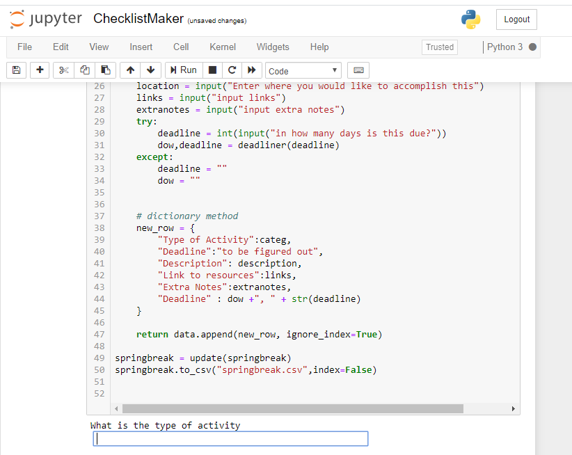

# Checklist Maker
I made this neat program in about an hour in order to create a way to orgranize my priorties with python this spring break. To use it, simply run it with python, input some of your activities, and keep track of your priorities!

#  Repository Contents
Example.csv is an example CSV file that was created from information I entered into the program.
You can make your own csv files by inputting your own data in ChecklistMaker.ipynb

#  What I used
This program was extremely simple, and was built primarily with Pandas & Datetime. Despite the simplicity of the program concept, I learned a lot about the Python Datetime module. The program uses time deltas, time objects, and advanced date features. Given just a number of days until a deadline, the program is able to find the day of the week & date of the deadline.
